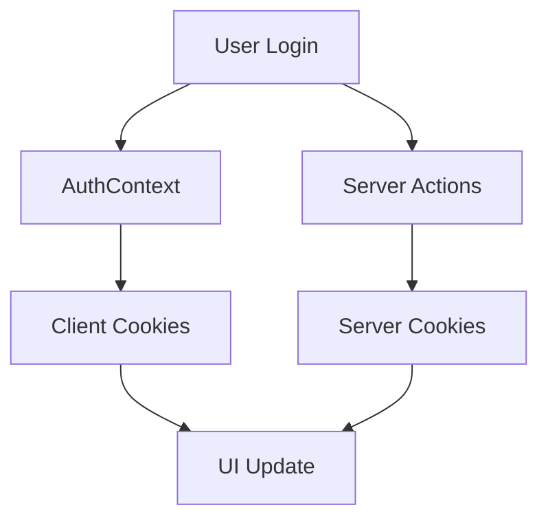

# 全体設計レビュー

## 総評

コンポーネント構造やTypeScriptの使用方法は良好ですが、認証システムの二重実装が設計の一貫性を著しく損ねています。アーキテクチャの統一が急務です。

## コンポーネント設計

### 👍 良い点

#### 1. 適切な責務分離
```typescript
// 良い例: ページコンポーネントとUIコンポーネントの分離
// src/app/mypage2/page.tsx
export default function MyPage2Page() {
  return <MyPage />;
}

// src/app/components/mypage2/MyPage.tsx
export default async function MyPage() {
  // 実際のロジック
}
```

#### 2. 一貫した命名規則
- ディレクトリ: kebab-case（`signin2`, `mypage2`）
- コンポーネント: PascalCase
- 関数・変数: camelCase

#### 3. 型安全性の確保
```typescript
// src/app/types/signin/auth.d.ts
export type User = {
  id: string;
  email: string;
  username: string;
  role: 'admin' | 'user';
  is_active: boolean;
  created_at: string;
  updated_at: string;
};
```

### ⚠️ 問題点

#### 1. 重大: アーキテクチャの二重実装
**問題**: 同じ機能に対して複数の実装が混在
- `signin` vs `signin2`
- `signup` vs `signup2`
- Context API vs Server Actions

**影響**: 
- メンテナンス性の低下
- バグの温床
- チーム開発時の混乱

**推奨**: Server Actions ベースに統一

#### 2. 認証状態管理の複雑性
```typescript
// 問題のあるクライアントサイド認証
// src/app/context/AuthContext.tsx
export const setCookie = (name: string, value: string, days = 7) => {
  const expires = new Date(Date.now() + days * 864e5).toUTCString();
  document.cookie = `${name}=${encodeURIComponent(value)}; expires=${expires}; path=/`;
};
```

**推奨**: サーバーサイドのセッション管理に一本化

## 状態管理パターン

### 現状の問題

#### 1. 認証状態の重複管理
- AuthContext（クライアント）
- cookies（サーバー）
- middleware（サーバー）

#### 2. データフローの複雑化


### 改善案: 統一されたアーキテクチャ

```typescript
// 提案: Data Access Layer パターン
// src/lib/dal/auth.ts
export class AuthDataAccess {
  async getCurrentUser(): Promise<User | null> {
    const session = await this.validateSession();
    if (!session) return null;
    
    return this.getUserById(session.userId);
  }
  
  private async validateSession() {
    const cookieStore = cookies();
    const token = cookieStore.get('session')?.value;
    
    if (!token) return null;
    
    try {
      return jwt.verify(token, process.env.JWT_SECRET!);
    } catch {
      return null;
    }
  }
}
```

## TypeScript 設計品質

### 👍 良い点

#### 1. 厳密な型定義
```typescript
// src/app/utils/validation.ts
export const signInSchema = z.object({
  email: z.string().email('有効なメールアドレスを入力してください'),
  password: z.string().min(6, 'パスワードは6文字以上である必要があります'),
});
```

#### 2. 適切な型エクスポート
```typescript
export type SignInFormState = {
  errors?: string[];
};
```

### ⚠️ 改善点

#### 1. 型定義の重複
**問題**: 複数箇所で同じUserタイプが定義されている

**推奨**: 共通型定義ライブラリの作成
```typescript
// src/shared/types/index.ts
export type User = {
  id: string;
  email: string;
  role: 'admin' | 'user';
  created_at: string;
  updated_at: string;
};

// 各機能での再利用
export type AuthUser = Pick<User, 'id' | 'email' | 'role'>;
export type UserProfile = Omit<User, 'id'>;
```

#### 2. バリデーションの統一
**問題**: Zodスキーマと手動バリデーションが混在

**推奨**: Zodスキーマに統一
```typescript
// src/shared/schemas/user.ts
export const userSchema = z.object({
  id: z.string().uuid(),
  email: z.string().email(),
  role: z.enum(['admin', 'user']),
});

export type UserType = z.infer<typeof userSchema>;
```

## パフォーマンス設計

### 現状分析

#### バンドルサイズ (良好)
```
First Load JS: 101 kB
├ chunks/pages/_app.js: 81.5 kB
├ chunks/webpack.js: 993 B
└ css/globals.css: 195 B
```

#### Server/Client コンポーネント使用状況
```typescript
// 良い例: Server Component
// src/app/components/mypage2/MyPage.tsx
export default async function MyPage() {
  const cookieStore = await cookies();
  // サーバーサイドでデータ取得
}

// 改善が必要: 不必要な Client Component
// 一部のコンポーネントで 'use client' が過度に使用
```

### 改善提案

#### 1. 動的インポートの活用
```typescript
// 重いコンポーネントの遅延読み込み
const AdminPanel = dynamic(() => import('@/features/admin/ui/Panel'), {
  loading: () => <AdminSkeleton />,
  ssr: false, // 必要に応じて
});
```

#### 2. データ取得の最適化
```typescript
// 現状: 各コンポーネントで個別取得
// 推奨: 統合されたデータ取得戦略

export async function getServerSideProps() {
  const [user, todos] = await Promise.all([
    getUserData(),
    getTodosData(),
  ]);
  
  return { props: { user, todos } };
}
```

## エラーハンドリング設計

### 👍 良い実装
```typescript
// src/app/components/signin2/actions.ts
const errors: string[] = [];
if (typeof email !== 'string' || typeof password !== 'string') {
  errors.push('フォームの入力が不正です');
  return { errors };
}
```

### 改善提案

#### 1. エラーバウンダリの導入
```typescript
// src/app/components/ErrorBoundary.tsx
export function ErrorBoundary({ children }: { children: React.ReactNode }) {
  return (
    <ErrorBoundary fallback={<ErrorFallback />}>
      {children}
    </ErrorBoundary>
  );
}
```

#### 2. 統一されたエラーハンドリング
```typescript
// src/lib/errors.ts
export class AppError extends Error {
  constructor(
    message: string,
    public code: string,
    public statusCode: number = 500
  ) {
    super(message);
  }
}

export function handleError(error: unknown): AppError {
  if (error instanceof AppError) return error;
  
  console.error('Unexpected error:', error);
  return new AppError('システムエラーが発生しました', 'INTERNAL_ERROR');
}
```

## 推奨リファクタリング計画

### フェーズ1: 統合（2週間）
1. 認証システムの統一（Server Actions のみ）
2. 重複コンポーネントの削除
3. 型定義の統一

### フェーズ2: 最適化（4週間）
1. Data Access Layer の実装
2. エラーハンドリングの統一
3. パフォーマンス最適化

### フェーズ3: 強化（6週間）
1. 詳細なログ機能
2. モニタリング
3. ドキュメント整備

## まとめ

基盤となる設計は良好ですが、認証システムの二重実装が全体の品質を著しく低下させています。Server Actions ベースのシンプルなアーキテクチャに統一することで、保守性とセキュリティの両方を大幅に改善できます。